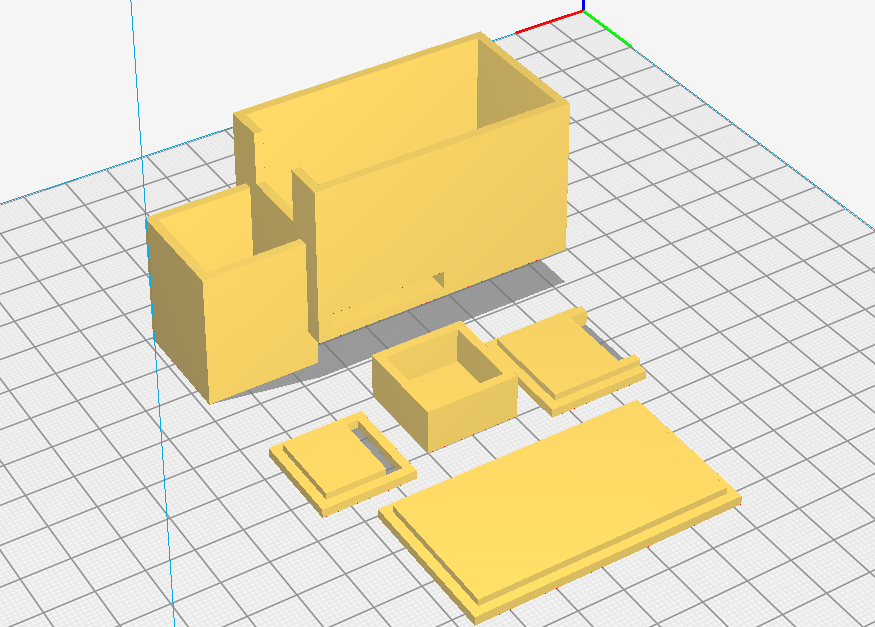

# Casing

This is our developed casing. Working with this powerbank: https://www.amazon.de/dp/B00S6B5J42

## Print settings

We recommend the following settings for your slicer:

* Infill: 20%

* The ARTrate-Main-Bottom.stl file **needs support, but only touching the buildplate.**

